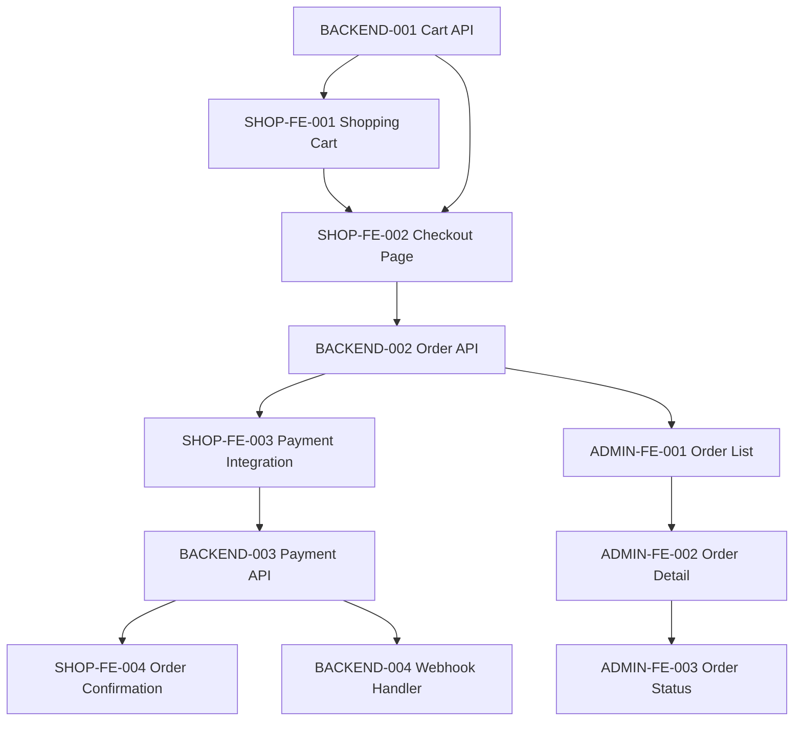

# FEATURE-001: 完整订单流程

> **示例任务：跨角色任务**

**创建时间:** 2026-02-08
**状态:** 准备开发
**类型:** 跨角色功能
**涉及角色:** SHOP-FE, ADMIN-FE, BACKEND

---

## 概述

### 问题陈述

当前系统缺少完整的订单处理流程，用户无法完成从浏览商品到支付订单的完整购物体验。

### 解决方案

实现端到端的订单流程，包括：浏览商品 → 加入购物车 → 结账 → 支付 → 订单确认 → 后台管理。

### 范围 (包含/排除)

**包含:**
- 商城购物车功能
- 结账流程
- Stripe 支付集成
- 订单创建和管理
- 后台订单管理界面

**不包含:**
- 优惠券系统
- 积分系统
- 物流跟踪
- 退款流程

---

## 子任务

### 独立站前端任务 (SHOP-FE)

| 任务ID | 文件 | 描述 | 状态 |
|--------|------|------|------|
| SHOP-FE-001 | [./active/shop-frontend/SHOP-FE-001-shopping-cart.md](./active/shop-frontend/SHOP-FE-001-shopping-cart.md) | 购物车功能和侧边栏 | ⏳ 待开始 |
| SHOP-FE-002 | [./active/shop-frontend/SHOP-FE-002-checkout-page.md](./active/shop-frontend/SHOP-FE-002-checkout-page.md) | 结账页面实现 | ⏳ 待开始 |
| SHOP-FE-003 | [./active/shop-frontend/SHOP-FE-003-payment-integration.md](./active/shop-frontend/SHOP-FE-003-payment-integration.md) | Stripe Elements 集成 | ⏳ 待开始 |
| SHOP-FE-004 | [./active/shop-frontend/SHOP-FE-004-order-confirmation.md](./active/shop-frontend/SHOP-FE-004-order-confirmation.md) | 订单确认页面 | ⏳ 待开始 |

### 后端任务 (BACKEND)

| 任务ID | 文件 | 描述 | 状态 |
|--------|------|------|------|
| BACKEND-001 | [./active/backend/BACKEND-001-cart-api.md](./active/backend/BACKEND-001-cart-api.md) | 购物车 API | ⏳ 待开始 |
| BACKEND-002 | [./active/backend/BACKEND-002-order-api.md](./active/backend/BACKEND-002-order-api.md) | 订单 CRUD API | ⏳ 待开始 |
| BACKEND-003 | [./active/backend/BACKEND-003-payment-api.md](./active/backend/BACKEND-003-payment-api.md) | 支付 API | ⏳ 待开始 |
| BACKEND-004 | [./active/backend/BACKEND-004-webhook-handler.md](./active/backend/BACKEND-004-webhook-handler.md) | Stripe Webhook | ⏳ 待开始 |

### 后台管理前端任务 (ADMIN-FE)

| 任务ID | 文件 | 描述 | 状态 |
|--------|------|------|------|
| ADMIN-FE-001 | [./active/admin-frontend/ADMIN-FE-001-order-list.md](./active/admin-frontend/ADMIN-FE-001-order-list.md) | 订单列表页面 | ⏳ 待开始 |
| ADMIN-FE-002 | [./active/admin-frontend/ADMIN-FE-002-order-detail.md](./active/admin-frontend/ADMIN-FE-002-order-detail.md) | 订单详情页面 | ⏳ 待开始 |
| ADMIN-FE-003 | [./active/admin-frontend/ADMIN-FE-003-order-status.md](./active/admin-frontend/ADMIN-FE-003-order-status.md) | 订单状态管理 | ⏳ 待开始 |

---

## 依赖关系



### 执行顺序建议

**阶段 1：基础 API 和购物车**
1. BACKEND-001 (Cart API)
2. SHOP-FE-001 (Shopping Cart)

**阶段 2：结账流程**
3. BACKEND-002 (Order API)
4. SHOP-FE-002 (Checkout Page)

**阶段 3：支付集成**
5. SHOP-FE-003 (Payment Integration)
6. BACKEND-003 (Payment API)
7. BACKEND-004 (Webhook Handler)
8. SHOP-FE-004 (Order Confirmation)

**阶段 4：后台管理**
9. ADMIN-FE-001 (Order List)
10. ADMIN-FE-002 (Order Detail)
11. ADMIN-FE-003 (Order Status)

---

## API 契约

### 购物车 API (BACKEND-001)

```typescript
// GET /api/cart
// POST /api/cart/items
// PATCH /api/cart/items/:id
// DELETE /api/cart/items/:id
```

### 订单 API (BACKEND-002)

```typescript
// POST /api/orders
// GET /api/orders/:id
// GET /api/orders (admin)
// PATCH /api/orders/:id/status (admin)
```

### 支付 API (BACKEND-003)

```typescript
// POST /api/payments/create-intent
// POST /api/payments/webhook
```

---

## 数据流

```
用户浏览商品
    │
    ▼
加入购物车 (SHOP-FE-001 → BACKEND-001)
    │
    ▼
进入结账 (SHOP-FE-002 → BACKEND-002)
    │
    ▼
创建支付意图 (BACKEND-003)
    │
    ▼
完成支付 (SHOP-FE-003 → Stripe)
    │
    ▼
Webhook 通知 (BACKEND-004)
    │
    ▼
订单确认 (SHOP-FE-004)
    │
    ▼
后台管理 (ADMIN-FE-001/002/003)
```

---

## 验收标准

### 整体验收

- [ ] 用户可以浏览商品并加入购物车
- [ ] 购物车可以修改数量和删除商品
- [ ] 用户可以进入结账页面填写信息
- [ ] 用户可以完成 Stripe 支付
- [ ] 支付成功后显示订单确认
- [ ] 管理员可以在后台查看所有订单
- [ ] 管理员可以查看订单详情
- [ ] 管理员可以更新订单状态

### 技术验收

- [ ] 所有 API 有完整的错误处理
- [ ] 支付流程有幂等性保护
- [ ] 前端有适当的加载状态
- [ ] 所有操作有日志记录
- [ ] 敏感信息不记录在日志中

---

## 风险和注意事项

| 风险 | 影响 | 缓解措施 |
|------|------|----------|
| 支付集成复杂 | 高 | 优先实现，预留充足时间 |
| Webhook 可靠性 | 高 | 实现重试机制和幂等性 |
| 跨团队协调 | 中 | 使用文档明确 API 契约 |
| 数据一致性 | 中 | 使用数据库事务 |

---

## 相关文档

- [购物车 API](../../../02-api/cart.md)
- [订单 API](../../../02-api/orders.md)
- [支付 API](../../../02-api/payments.md)
- [Stripe 集成指南](../../../03-guides/stripe-elements.md)
