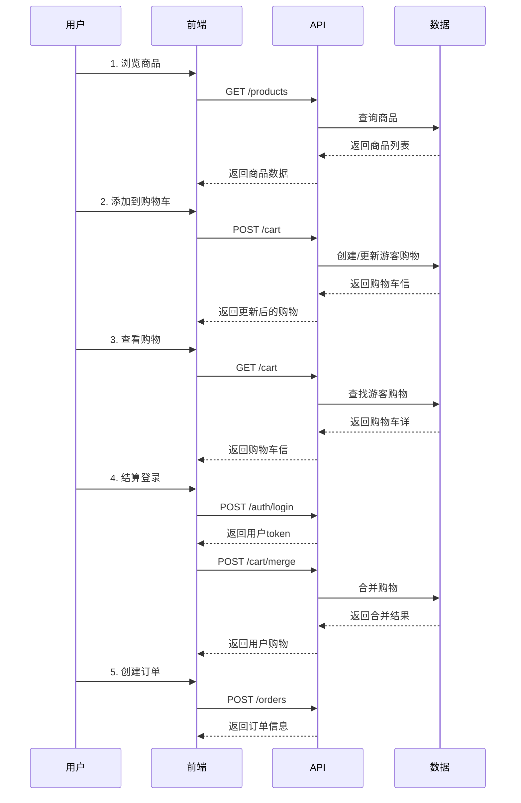
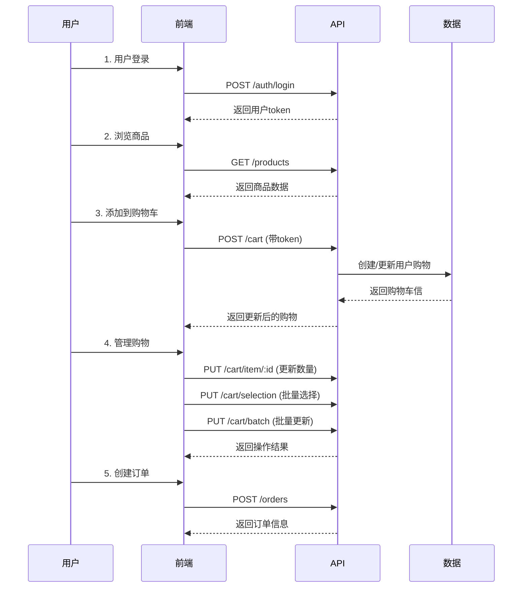

### 📊 购物车操作API响应格式统一标准


**v1.11.1 更新**: 所有购物车操作API现在都返回统一的CartResponse响应结构，确保前端集成的一致性


**统一响应的API端点**:

- `PUT /cart/item/:id` - 更新购物车项

- `PUT /cart/selection` - 更新选择状态

- `DELETE /cart/item/:id` - 删除单个项目

- `DELETE /cart/clear` - 清空购物

- `DELETE /cart/batch` - 批量删除（成功时


**标准响应格式**:

```json

{

  "code": 200,

  "message": "Success",

  "data": {

    "id": "cart_id",

    "userId": "user_id",           // 登录用户，游客为null

    "sessionId": "session_id",    // 游客会话，登录用户为null

    "status": "ACTIVE",

    "totalAmount": 299.99,        // 仅选中商品总价

    "itemCount": 2,               // 仅选中商品数量

    "selectedCount": 2,           // 选中商品种类

    "selectedAmount": 299.99,     // 选中商品总金额（明确字段

    "items": [...],               // 完整购物车商品列

    "expiresAt": "2025-01-14T06:00:55.070Z",

    "createdAt": "2025-12-15T06:00:55.072Z",

    "updatedAt": "2025-12-15T06:00:55.072Z"

  },

  "timestamp": "2025-12-15T14:00:00.000Z",

  "success": true

}

```


**前端集成优势**:

- 🚀 **无需额外请求**: 操作后直接返回最新购物车状态

- 🔄 **实时数据同步**: 避免数据不一致问题

- 📱 **统一处理**: 所有操作使用相同的响应处理逻辑

- **性能优化**: 减少API调用次数


### 购物车概述


购物车模块支持**游客模式**和**登录用户模式**的统一体验，提供完整的购物车功能


**核心特性**:

- **游客购物车**：无需注册即可使用购物车，通过X-Guest-ID头识别

- **登录用户购物车**：完整的用户购物车管理，基于JWT认证

- **智能合并**: 用户登录时自动合并游客购物车

- **批量操作**: 支持批量更新、删除、选择操作

- **自动过期**: 购物车 30 天后自动过期机制

- **数据验证**: 商品有效性验证（状库存+删除状态）

- **实时统计**: 基于有效商品自动计算总金额和数量

- 💰 **实时价格计算**: 购物车价格实时从商品表获取，解决价格同步问题

- 🛒**智能过滤**: 自动过滤下架+缺货+删除商品，确保只返回有效商品


### 认证策略


#### 可选认证(Optional Authentication)

- **Header**: `Authorization: Bearer <token>` (可选）

- **Header**: `X-Guest-ID: <guest-session-id>` (游客模式必需)

- **用于**: 所有购物车接口

- **逻辑**:

  - 有token且无X-Guest-ID 使用用户购物

  - 有X-Guest-ID且无token 使用游客购物

  - 都有 使用用户购物车（推荐））

  - 都无 返回错误，需要至少一种身份标识识


### 💰 实时价格计算机制 (v1.6.0 重大更新)


#### 价格计算原理

购物车采用计算属性模式，不再存储商品价格快照，所有价格实时从商品表获取：


```javascript

// 实时价格计算逻辑

const currentPrice = item.product.price;        // 实时获取商品当前价格

const calculatedTotalPrice = currentPrice * item.quantity; // 动态计算总价


// 购物车响应

{

  "price": currentPrice,           // 实时价格

  "totalPrice": calculatedTotalPrice, // 实时计算总价

  "product": {

    "price": currentPrice          // 商品当前价格，与cart.price保持一致

  }

}

```


#### 解决的问题

**Before (价格不同步问题)**:

- 购物车存储商品添加时的价格快照

- 后台更新商品价格后，购物车仍显示旧价

- 用户结算时金额错误


**After (实时价格同步)**:

- 购物车不存储价格，只存储商品ID和数量

- 每次获取购物车时实时计算价格

- 后台调价后立即反映在购物车中，零延迟


#### 技术优势

- **数据一致性**: 价格永远是最新的，无同步问题

- **架构简化**: 无需复杂的价格同步机制

- **零延迟**: 价格变化立即生效

- **存储优化**: 减少数据冗余，移除`cart_items.price`字段


#### 前端兼容性

- **API响应格式不变**: 仍返回`price`和`totalPrice`字段

- **前端代码无需修改**: 所有价格计算由后端完成

- **类型定义一致： 响应数据结构保持不变


### 🛒智能商品过滤机制 (v1.8.0 完善）


#### 过滤机制原理

购物车智能过滤所有无效商品，确保用户只能看到和结算可购买的商品：


```javascript

// 智能商品过滤逻辑

const validItems = cart.items.filter((item) => {

  // 三重过滤条件：启用状+ 有库+ 未逻辑删除

  return item.product &&

         item.product.status === 1 &&      // 启用状

         item.product.stock > 0 &&          // 有库

         !item.product.isDeleted;           // 未逻辑删除

});


// 响应简

return {

  items: validItems                    // 只返回有效商

};

```


#### 完善的业务场景覆

**场景1: 商品下架**

- 用户添加商品A到购物车 

- 管理员下架商品A（status=0

- 用户查看购物车，商品A自动消失 

- 统计信息自动更新 


**场景2: 商品缺售**

- 用户添加商品B（库件）到购物车 

- 其他用户购买，商品B库存变为0

- 用户查看购物车，商品B自动消失 

- 统计信息自动更新 


**场景3: 商品恢复**

- 管理员重新上架商品A或补充库

- 用户查看购物车，商品A重新显示 

- 统计信息自动更新 


**场景4: 逻辑删除**

- 管理员逻辑删除商品C（isDeleted=true

- 用户查看购物车，商品C立即消失 

- 不会产生任何困惑或错


#### 技术优势

- **三重保护**: 状库存+删除状态三重验

- **完全透明**: 用户看不到任何无效商品，体验最少

- **实时同步**: 库存变化立即反映在购物车

- **动态统*: 基于有效商品实时计算总金额和数量

- **自动清理**: 无效商品自动从购物车中移


#### 过滤类型说明

- **下架商品**: `product.status !== 1` - 管理员手动下

- **缺货商品**: `product.stock <= 0` - 库存不足或为

- **删除商品**: `product.isDeleted === true` - 逻辑删除的商


### 数据模型


#### Cart Schema

```json

{

  "id": "string",           // 购物车ID (cuid格式)

  "userId": "string|null",  // 用户ID（游客为null

  "sessionId": "string|null", // 游客会话ID（用户为null

  "status": "ACTIVE",       // 购物车状(ACTIVE, EXPIRED, CHECKEDOUT)

  "totalAmount": 299.98,    // 🔥 修复：总金额(number类型，仅基于选中商品计算：有库存+已上未删selected=true)

  "itemCount": 2,           // 🔥 修复：商品总数量（仅计算选中商品

  "selectedCount": 1,       // 🆕 新增：选中商品的种类数

  "selectedAmount": 299.98, // 🆕 新增：选中商品总金额（明确字段

  "expiresAt": "2026-01-07T10:30:00.000Z", // 过期时间0天后

  "createdAt": "2025-12-08T10:30:00.000Z",

  "updatedAt": "2025-12-08T10:30:00.000Z",

  "items": [CartItem]      // 优化：购物车项列表，仅包含有效商

}

```


#### CartItem Schema

```json

{

  "id": "string",         // 购物车项ID (cuid格式)

  "cartId": "string",     // 购物车ID

  "productId": "string",  // 商品ID

  "quantity": 2,          // 数量

  "price": 149.99,         // 💰 实时价格 (number类型，实时获

  "totalPrice": 299.98,   // 单项总价 (实时计算: price × quantity)

  "selected": true,       // 是否选中结算 (boolean)

  "product": {            // 商品信息

    "id": "string",

    "name": "智能温度传感,

    "description": "高精度温度监测传感器，适用于各种环境监测场,

    "price": 149.99,        // 当前商品价格 (number类型，实时同

    "originalPrice": 199.99,

    "stock": 100,

    "images": [            // 优化：图片数(之前是逗号分隔字符）

      "https://oss.moxton.cn/product1.jpg",

      "https://oss.moxton.cn/product2.jpg"

    ],

    "status": 1

  },

  "createdAt": "2025-12-08T10:30:00.000Z",

  "updatedAt": "2025-12-08T10:30:00.000Z"

}

```


#### 数据库表结构


**Cart*:

```sql

CREATE TABLE carts (

  id VARCHAR(255) PRIMARY KEY,

  userId VARCHAR(255) NULL,           -- 用户ID（可选）））

  sessionId VARCHAR(255) NULL,        -- 游客会话ID（可选）））

  status VARCHAR(50) DEFAULT 'ACTIVE', -- 购物车状态

  totalAmount DECIMAL(10,2) DEFAULT 0, -- 总金额

  itemCount INT DEFAULT 0,            -- 商品数量

  expiresAt DATETIME DEFAULT (NOW() + INTERVAL 30 DAY), -- 30天后过期

  createdAt DATETIME DEFAULT NOW(),

  updatedAt DATETIME ON UPDATE NOW(),


  INDEX idx_userId (userId),

  INDEX idx_sessionId (sessionId),

  INDEX idx_expiresAt (expiresAt)

);

```


**CartItem*:

```sql

CREATE TABLE cart_items (

  id VARCHAR(255) PRIMARY KEY,

  cartId VARCHAR(255) NOT NULL,

  productId VARCHAR(255) NOT NULL,

  quantity INT DEFAULT 1,

  selected BOOLEAN DEFAULT TRUE,

  isDeleted BOOLEAN DEFAULT FALSE,

  createdAt DATETIME DEFAULT NOW(),

  updatedAt DATETIME ON UPDATE NOW(),


  FOREIGN KEY (cartId) REFERENCES carts(id) ON DELETE CASCADE,

  FOREIGN KEY (productId) REFERENCES products(id),

  INDEX idx_cartId (cartId),

  INDEX idx_productId (productId)

);

```


### 获取购物


**GET** `/cart`


**认证**: Optional (支持游客和用户


**请求*:

- `Authorization: Bearer <token>` (可选，用户模式)

- `X-Guest-ID: <guest-session-id>` (可选，游客模式)


**说明**: 获取当前用户或游客的购物车信息，包括所有购物车


**身份识别逻辑**:

- 有token且无X-Guest-ID 使用用户购物

- 有X-Guest-ID且无token 使用游客购物

- 都有 使用用户购物车（推荐））

- 都无 返回错误，需要至少一种身份标识识


**响应**:

```json

{

  "code": 200,

  "message": "Success",

  "data": {

    "id": "cmix0fw5e0001vfssof49fueb",

    "userId": "user-123456789",     // 游客购物车为null

    "sessionId": null,              // 用户购物车为null

    "status": "ACTIVE",

    "totalAmount": 599.96,          // 🔥 修复：number类型（仅选中商品：有库存+已上未删selected=true

    "itemCount": 4,                 // 🔥 修复：仅计算选中商品数量

    "selectedCount": 3,             // 🆕 新增：选中商品的种类数

    "selectedAmount": 599.96,       // 🆕 新增：选中商品总金额（明确字段

    "items": [

      {

        "id": "cmix0g12j0002vfssof50g12k",

        "productId": "cmir9h2h80001vf54v24qrz75",

        "quantity": 2,

        "price": 149.99,

        "totalPrice": 299.98,          // 新增：单项总价

        "selected": true,

        "product": {

          "id": "cmir9h2h80001vf54v24qrz75",

          "name": "智能温度传感,

          "description": "高精度温度监测传感器，适用于各种环境监测场,

          "price": 149.99,               // 优化：number类型

          "originalPrice": 199.99,

          "stock": 100,

          "images": [                    // 优化：图片数

            "https://oss.moxton.cn/product1.jpg",

            "https://oss.moxton.cn/product2.jpg"

          ],

          "status": 1

        },

        "createdAt": "2025-12-08T10:30:00.000Z",

        "updatedAt": "2025-12-08T10:30:00.000Z"

      }

    ],

    "expiresAt": "2026-01-07T10:30:00.000Z",

    "createdAt": "2025-12-08T10:30:00.000Z",

    "updatedAt": "2025-12-08T10:30:00.000Z"

  },

  "success": true,

  "timestamp": "2025-12-08T10:30:00.000Z"

}

```


**游客模式响应示例**:

```json

{

  "code": 200,

  "message": "Success",

  "data": {

    "id": "cmix0fw5e0001vfssof49fueb",

    "userId": null,                     // 游客购物

    "sessionId": "guest-session-abc123",

    "status": "ACTIVE",

    "totalAmount": 299.98,              // 🔥 修复：number类型（仅选中商品：有库存+已上未删selected=true

    "itemCount": 2,                     // 🔥 修复：仅计算选中商品数量

    "selectedCount": 1,                 // 🆕 新增：选中商品的种类数

    "selectedAmount": 299.98,           // 🆕 新增：选中商品总金额（明确字段

    "items": [...],                     // 优化：包含totalPrice字段和图片数组，仅有效商

    "expiresAt": "2026-01-07T10:30:00.000Z",

    "createdAt": "2025-12-08T10:30:00.000Z",

    "updatedAt": "2025-12-08T10:30:00.000Z"

  },

  "success": true

}

```


**错误响应**:

```json

{

  "code": 400,

  "message": "Guest ID is required. Please provide X-Guest-ID header",

  "data": null,

  "success": false,

  "timestamp": "2025-12-08T10:30:00.000Z"

}

```


### 添加商品到购物车


**POST** `/cart`


**认证**: Optional (支持游客和用户


**请求*:

- `Authorization: Bearer <token>` (可选，用户模式)

- `X-Guest-ID: <guest-session-id>` (可选，游客模式)


**请求*:

```json

{

  "productId": "cmir9h2h80001vf54v24qrz75",

  "quantity": 2

}

```


**参数说明**:

- `productId` (必需): 商品ID，必须是有效的商

- `quantity` (必需): 数量，必须大


**业务逻辑**:

- 自动检查商品是否存在且状态为启用

- 自动检查库存是否充

- 如果购物车中已有相同商品，则增加数量

- 如果没有，则创建新的购物车项


**响应**:

```json

{

  "code": 200,

  "message": "Product added to cart successfully",

  "data": {

    "id": "cmix0fw5e0001vfssof49fueb",

    "userId": "user-123456789",

    "sessionId": null,

    "status": "ACTIVE",

    "totalAmount": 599.96,              // 优化：number类型

    "itemCount": 4,

    "list": [

      {

        "id": "cmix0g12j0002vfssof50g12k",

        "productId": "cmir9h2h80001vf54v24qrz75",

        "quantity": 2,

        "price": 149.99,

        "totalPrice": 299.98,             // 新增：单项总价

        "selected": true,

        "product": {

          "id": "cmir9h2h80001vf54v24qrz75",

          "name": "智能温度传感,

          "description": "高精度温度监测传感器，适用于各种环境监测场,

          "price": 149.99,                   // 优化：number类型

          "originalPrice": 199.99,

          "stock": 100,

          "images": ["https://oss.moxton.cn/product1.jpg"],

          "status": 1

        },

        "createdAt": "2025-12-08T10:30:00.000Z",

        "updatedAt": "2025-12-08T10:30:00.000Z"

      }

    ],

    "expiresAt": "2026-01-07T10:30:00.000Z",

    "createdAt": "2025-12-08T10:30:00.000Z",

    "updatedAt": "2025-12-08T10:30:00.000Z"

  },

  "success": true,

  "timestamp": "2025-12-08T10:30:00.000Z"

}

```


**错误响应示例**:

```json

{

  "code": 400,

  "message": "Product ID is required",

  "data": null,

  "success": false,

  "timestamp": "2025-12-08T10:30:00.000Z"

}

```


```json

{

  "code": 400,

  "message": "Quantity must be greater than 0",

  "data": null,

  "success": false,

  "timestamp": "2025-12-08T10:30:00.000Z"

}

```


```json

{

  "code": 400,

  "message": "Failed to add item to cart: test-123",

  "data": null,

  "success": false,

  "timestamp": "2025-12-08T10:30:00.000Z"

}

```


### 更新购物车项


**PUT** `/cart/item/:itemId`


**认证**: Optional (支持游客和用户


**参数**:

- `itemId` (路径参数): 购物车项ID


**请求*:

```json

{

  "quantity": 3,

  "selected": false

}

```


**参数说明**:

- `quantity` (可选: 新数量，必须大于0

- `selected` (可选: 是否选中结算


**响应**:

```json

{

  "code": 200,

  "message": "Cart item updated successfully",

  "data": {

    "id": "item-123456789",

    "productId": "product-123456789",

    "quantity": 3,

    "price": 149.99,

    "totalPrice": 449.97,          // 新增：单项总价 (149.99 × 3)

    "selected": false,

    "createdAt": "2023-12-01T10:00:00.000Z",

    "updatedAt": "2023-12-01T10:10:00.000Z"

  },

  "success": true

}

```


### 从购物车删除商品（物理删除）


**DELETE** `/cart/item/:itemId`


**认证**: Optional (支持游客和用户


**参数**:

- `itemId` (路径参数): 购物车项ID


**说明**: 从购物车中删除指定商品项，使用物理删除，数据无法恢复


**身份识别**:

- 有token 使用用户购物

- 有X-Guest-ID 使用游客购物

- 都有 优先使用用户购物


**响应**:

```json

{

  "code": 200,

  "message": "Product removed from cart successfully",

  "data": {

    "message": "Product removed from cart successfully"

  },

  "success": true

}

```


**注意事项**:

- ⚠️ **永久删除**: 购物车项删除后无法恢

- 🔒 **权限控制**: 只能删除自己购物车中的商品项

- 💡 **业务逻辑**: 购物车是临时数据，物理删除符合业务特


### 清空购物车（物理删除


**DELETE** `/cart/clear`


**认证**: Optional (支持游客和用户


**说明**: 清空当前用户或游客的整个购物车，使用物理删除所有购物车项，数据无法恢复


**身份识别**:

- 有token 清空用户购物

- 有X-Guest-ID 清空游客购物

- 都有 优先清空用户购物


**响应**:

```json

{

  "code": 200,

  "message": "Cart cleared successfully",

  "data": CartResponse,  // 清空后的完整购物车状态（空购物车

  "timestamp": "2025-12-15T14:00:00.000Z",

  "success": true

}

```


**注意事项**:

- ⚠️ **永久删除**: 所有购物车项将被物理删除，无法恢复

- 💡 **业务逻辑**: 购物车是临时数据，清空操作符合用户预

- 🔒 **权限控制**: 只能清空自己的购物车


### 批量删除购物车项（物理删除）


**DELETE** `/cart/batch`


**认证**: Optional (支持游客和用户


**功能**: 批量删除多个购物车项，支持游客和用户，一次最少0


**请求*:

```json

{

  "itemIds": ["item-123", "item-456", "item-789"]

}

```


**参数说明**:

- `itemIds` (必需): 购物车项ID数组，最少0


**身份识别**:

- 有token 使用用户购物

- 有X-Guest-ID 使用游客购物

- 都有 优先使用用户购物


**响应**:

```json

// 成功

{

  "code": 200,

  "message": "Success",

  "data": CartResponse,  // 删除后的完整购物车状态

  "timestamp": "2025-12-15T14:00:00.000Z",

  "success": true

}


// 部分失败

{

  "code": 400,

  "message": "Failed to remove 1 out of 3 items",

  "data": {

    "results": [

      { "itemId": "item-123", "success": true, "message": "Removed successfully" },

      { "itemId": "item-456", "success": true, "message": "Removed successfully" },

      { "itemId": "item-789", "success": false, "message": "Item not found" }

    ],

    "cart": CartResponse,  // 操作后的购物车状态

    "failedCount": 1,

    "successCount": 2

  },

  "timestamp": "2025-12-15T14:00:00.000Z",

  "success": false

}

```


**功能特点**:

- **权限验证**: 游客只能删除自己的购物车项，用户只能删除自己

- ⚠️ **物理删除**: 直接从数据库删除购物车项，数据无法恢

- **批量限制**: 一次最多删0个购物车

- **错误处理**: 部分失败时返回详细的成功/失败信息


**注意事项**:

- ⚠️ **永久删除**: 购物车项删除后无法恢复，请谨慎操

- 💡 **业务逻辑**: 购物车是临时数据，物理删除符合业务特

- 🔒 **安全考虑**: 只能删除自己购物车中的商品项


### 批量更新购物车项选择状态


**PUT** `/cart/selection`


**认证**: Optional (支持游客和用户


**说明**: 批量更新多个购物车项的选择状态，用于订单结算前的商品选择


**请求*:

```json

{

  "itemIds": ["item-123", "item-456", "item-789"],

  "selected": true

}

```


**参数说明**:

- `itemIds` (必需): 购物车项ID数组

- `selected` (必需): 选择状态，true=选中，false=取消选中


**响应**:

```json

{

  "code": 200,

  "message": "Success",

  "data": {

    "id": "cmiy7tacl0001vf4ca070951a",

    "userId": null,

    "sessionId": "test-response-check",

    "status": "ACTIVE",

    "totalAmount": 66,            // 🔥 修复：仅选中商品总金额

    "itemCount": 2,               // 🔥 修复：仅选中商品数量

    "selectedCount": 2,           // 🆕 新增：选中商品种类

    "selectedAmount": 66,         // 🆕 新增：选中商品总金额

    "items": [CartItem],        // 更新后的购物车项列表

    "expiresAt": "2026-01-08T06:44:25.895Z",

    "createdAt": "2025-12-09T06:44:25.893Z",

    "updatedAt": "2025-12-09T06:48:28.428Z"

  },

  "success": true

}

```


**响应字段说明**:

- 直接返回更新后的完整购物车信息，包含重新计算的总金额和选中状

- `selectedCount`: 选中商品的种类数

- `selectedAmount`: 选中商品的总金额


**错误响应**:

```json

{

  "code": 400,

  "message": "Failed to update 1 items",

  "data": [

    {

      "itemId": "item-123",

      "success": false,

      "message": "Access denied"

    }

  ],

  "success": false

}

```


### 批量更新购物车项


**PUT** `/cart/batch`


**认证**: Optional (支持游客和用户


**说明**: 批量更新购物车项的多个属性（数量、选择状态等


**请求*:

```json

{

  "list": [

    {

      "itemId": "item-123",

      "quantity": 2,

      "selected": true

    },

    {

      "itemId": "item-456",

      "quantity": 1,

      "selected": false

    }

  ]

}

```


**参数说明**:

- `items` (必需): 购物车项更新数组

  - `itemId` (必需): 购物车项ID

  - `quantity` (可选: 新数量，必须大于0

  - `selected` (可选: 选择状态


**响应**:

```json

{

  "code": 200,

  "message": "Success",

  "data": {

    "id": "cmiy7tacl0001vf4ca070951a",

    "userId": null,

    "sessionId": "test-response-check",

    "status": "ACTIVE",

    "totalAmount": 99,            // 🔥 修复：仅选中商品总金额

    "itemCount": 3,               // 🔥 修复：仅选中商品数量

    "selectedCount": 2,           // 🆕 新增：选中商品种类

    "selectedAmount": 99,         // 🆕 新增：选中商品总金额

    "items": [CartItem],        // 更新后的购物车项列表

    "expiresAt": "2026-01-08T06:44:25.895Z",

    "createdAt": "2025-12-09T06:44:25.893Z",

    "updatedAt": "2025-12-09T06:48:28.091Z"

  },

  "success": true

}

```


**响应字段说明**:

- 直接返回更新后的完整购物车信息，包含重新计算的总金额、数量和选中状

- `selectedCount`: 选中商品的种类数

- `selectedAmount`: 选中商品的总金额


**错误响应**:

```json

{

  "code": 400,

  "message": "Failed to update 1 items",

  "data": [

    {

      "itemId": "item-123",

      "success": true

    },

    {

      "itemId": "item-456",

      "success": false,

      "message": "Insufficient stock"

    }

  ],

  "success": false

}

```


### 获取购物车统计信


**GET** `/cart/summary`


**认证**: Optional (支持游客和用户


**说明**: 获取购物车的统计数据，包括总金额、总数量、选中项统计等


**响应**:

```json

{

  "code": 200,

  "message": "Success",

  "data": {

    "totalAmount": 599.96,    // 🔥 修复：选中商品总金额（selected=true

    "totalItems": 4,          // 🔥 修复：选中商品总数

    "selectedItems": 3,       // 选中商品种类

    "selectedAmount": 449.97  // 选中商品的总金额

  },

  "success": true,

  "timestamp": "2023-12-01T10:00:00.000Z"

}

```


### 合并购物


**POST** `/cart/merge`


**认证**: Required


**说明**: 用户登录时合并游客购物车到用户购物车


**请求*:

```json

{

  "guestSessionId": "guest-session-abc123"

}

```


**参数说明**:

- `guestSessionId` (必需): 游客会话ID


**响应**:

```json

{

  "code": 200,

  "message": "Cart merged successfully",

  "data": {

    "id": "cart-user-123456789",

    "userId": "user-123456789",

    "sessionId": null,

    "status": "ACTIVE",

    "totalAmount": 899.94,

    "itemCount": 6,

    "list": [...],

    "expiresAt": "2024-01-01T00:00:00.000Z",

    "createdAt": "2023-12-01T10:00:00.000Z",

    "updatedAt": "2023-12-01T10:15:00.000Z"

  },

  "success": true

}

```


### 验证购物


**GET** `/cart/validate`


**认证**: Optional (支持游客和用户


**说明**: 验证购物车的有效性，检查商品可用性、库存、价格等


**响应**:

```json

{

  "code": 200,

  "message": "Success",

  "data": {

    "isValid": false,

    "issues": [

      {

        "itemId": "item-123456789",

        "productId": "product-123456789",

        "productName": "智能温度传感,

        "issues": [

          "Insufficient stock. Available: 5",

          "Price changed from 149.99 to 159.99"

        ]

      }

    ],

    "validItems": [

      {

        "id": "item-123456790",

        "productId": "product-123456790",

        "quantity": 1,

        "price": 259.99,

        "selected": true,

        "product": {

          "id": "product-123456790",

          "name": "智能湿度传感,

          "stock": 50,

          "status": 1

        }

      }

    ],

    "invalidItemCount": 1

  },

  "success": true

}

```


### 🎯 购物车使用流


#### 游客购物流程




#### 用户购物流程




### 🔧 前端集成示例


#### JavaScript 购物车服务类

```javascript

class CartService {

  constructor(baseURL = '/api', token = null) {

    this.baseURL = baseURL;

    this.token = token;

  }


  // 获取请求

  getHeaders() {

    const headers = {

      'Content-Type': 'application/json'

    };

    if (this.token) {

      headers['Authorization'] = `Bearer ${this.token}`;

    }

    return headers;

  }


  // 获取购物

  async getCart() {

    const response = await fetch(`${this.baseURL}/cart`, {

      headers: this.getHeaders()

    });

    return response.json();

  }


  // 添加商品到购物车

  async addToCart(productId, quantity) {

    const response = await fetch(`${this.baseURL}/cart`, {

      method: 'POST',

      headers: this.getHeaders(),

      body: JSON.stringify({ productId, quantity })

    });

    return response.json();

  }


  // 更新购物车项

  async updateCartItem(itemId, updates) {

    const response = await fetch(`${this.baseURL}/cart/item/${itemId}`, {

      method: 'PUT',

      headers: this.getHeaders(),

      body: JSON.stringify(updates)

    });

    return response.json();

  }


  // 从购物车删除商品

  async removeFromCart(itemId) {

    const response = await fetch(`${this.baseURL}/cart/item/${itemId}`, {

      method: 'DELETE',

      headers: this.getHeaders()

    });

    return response.json();

  }


  // 清空购物

  async clearCart() {

    const response = await fetch(`${this.baseURL}/cart/clear`, {

      method: 'DELETE',

      headers: this.getHeaders()

    });

    return response.json();

  }


  // 获取购物车统

  async getCartSummary() {

    const response = await fetch(`${this.baseURL}/cart/summary`, {

      headers: this.getHeaders()

    });

    return response.json();

  }


  // 更新单项选择状态

  async updateItemSelection(itemId, selected) {

    const response = await fetch(`${this.baseURL}/cart/item/${itemId}`, {

      method: 'PUT',

      headers: this.getHeaders(),

      body: JSON.stringify({ selected })

    });

    return response.json();

  }


  // 新增：批量更新选择状态（推荐））使用

  async updateItemsSelection(itemIds, selected) {

    const response = await fetch(`${this.baseURL}/cart/selection`, {

      method: 'PUT',

      headers: this.getHeaders(),

      body: JSON.stringify({ itemIds, selected })

    });

    const result = await response.json();


    // 优化：响应包含更新后的购物车信息，无需额外调用getCart()

    if (result.success) {

      return {

        success: true,

        message: result.data.message,

        cart: result.data.cart  // 更新后的完整购物

      };

    }


    return { success: false, message: result.message };

  }


  // 新增：批量更新购物车项（支持数量和选择状态）

  async batchUpdateCartItems(items) {

    const response = await fetch(`${this.baseURL}/cart/batch`, {

      method: 'PUT',

      headers: this.getHeaders(),

      body: JSON.stringify({ items })

    });

    const result = await response.json();


    // 优化：响应包含更新后的购物车信息和详细操作结

    if (result.success) {

      return {

        success: true,

        message: result.data.message,

        updatedItems: result.data.updatedItems,

        cart: result.data.cart  // 更新后的完整购物车，包含重新计算的总金额

      };

    }


    return {

      success: false,

      message: result.message,

      updatedItems: result.data?.updatedItems,

      cart: result.data?.cart  // 即使部分失败也返回当前购物车状态

    };

  }


  // 合并购物车（用户登录时）

  async mergeCart(guestSessionId) {

    const response = await fetch(`${this.baseURL}/cart/merge`, {

      method: 'POST',

      headers: this.getHeaders(),

      body: JSON.stringify({ guestSessionId })

    });

    return response.json();

  }


  // 验证购物

  async validateCart() {

    const response = await fetch(`${this.baseURL}/cart/validate`, {

      headers: this.getHeaders()

    });

    return response.json();

  }


  // 设置token（用户登录后

  setToken(token) {

    this.token = token;

  }


  // 清除token（用户登出）

  clearToken() {

    this.token = null;

  }

}


// 使用示例

const cartService = new CartService();


// 游客模式添加商品

cartService.addToCart('product-123', 2)

  .then(result => {

    if (result.success) {

      console.log('商品添加成功', result.data);

    } else {

      console.error('添加失败', result.message);

    }

  });


// 用户登录

const userToken = localStorage.getItem('userToken');

cartService.setToken(userToken);


// 获取用户购物

cartService.getCart()

  .then(result => {

    if (result.success) {

      console.log('购物车信, result.data);

    }

  });

```


#### React Hook 示例

```javascript

import { useState, useEffect, useCallback } from 'react';


export const useCart = (token = null) => {

  const [cart, setCart] = useState(null);

  const [loading, setLoading] = useState(false);

  const [error, setError] = useState(null);


  // 获取购物

  const fetchCart = useCallback(async () => {

    setLoading(true);

    setError(null);


    try {

      const headers = {

        'Content-Type': 'application/json'

      };

      if (token) {

        headers['Authorization'] = `Bearer ${token}`;

      }


      const response = await fetch('/api/cart', { headers });

      const result = await response.json();


      if (result.success) {

        setCart(result.data);

      } else {

        setError(result.message);

      }

    } catch (err) {

      setError('网络错误');

    } finally {

      setLoading(false);

    }

  }, [token]);


  // 添加商品到购物车

  const addToCart = useCallback(async (productId, quantity) => {

    setLoading(true);


    try {

      const headers = {

        'Content-Type': 'application/json'

      };

      if (token) {

        headers['Authorization'] = `Bearer ${token}`;

      }


      const response = await fetch('/api/cart', {

        method: 'POST',

        headers,

        body: JSON.stringify({ productId, quantity })

      });


      const result = await response.json();


      if (result.success) {

        setCart(result.data);

        return { success: true };

      } else {

        setError(result.message);

        return { success: false, message: result.message };

      }

    } catch (err) {

      const errorMsg = '网络错误';

      setError(errorMsg);

      return { success: false, message: errorMsg };

    } finally {

      setLoading(false);

    }

  }, [token]);


  // 更新购物车项

  const updateCartItem = useCallback(async (itemId, updates) => {

    setLoading(true);


    try {

      const headers = {

        'Content-Type': 'application/json'

      };

      if (token) {

        headers['Authorization'] = `Bearer ${token}`;

      }


      const response = await fetch(`/api/cart/item/${itemId}`, {

        method: 'PUT',

        headers,

        body: JSON.stringify(updates)

      });


      const result = await response.json();


      if (result.success) {

        await fetchCart(); // 重新获取购物

        return { success: true };

      } else {

        setError(result.message);

        return { success: false, message: result.message };

      }

    } catch (err) {

      const errorMsg = '网络错误';

      setError(errorMsg);

      return { success: false, message: errorMsg };

    } finally {

      setLoading(false);

    }

  }, [token, fetchCart]);


  // 删除购物车项

  const removeFromCart = useCallback(async (itemId) => {

    setLoading(true);


    try {

      const headers = {

        'Content-Type': 'application/json'

      };

      if (token) {

        headers['Authorization'] = `Bearer ${token}`;

      }


      const response = await fetch(`/api/cart/item/${itemId}`, {

        method: 'DELETE',

        headers

      });


      const result = await response.json();


      if (result.success) {

        await fetchCart(); // 重新获取购物

        return { success: true };

      } else {

        setError(result.message);

        return { success: false, message: result.message };

      }

    } catch (err) {

      const errorMsg = '网络错误';

      setError(errorMsg);

      return { success: false, message: errorMsg };

    } finally {

      setLoading(false);

    }

  }, [token, fetchCart]);


  // 初始化获取购物车

  useEffect(() => {

    fetchCart();

  }, [fetchCart]);


  return {

    cart,

    loading,

    error,

    fetchCart,

    addToCart,

    updateCartItem,

    removeFromCart

  };

};


// 在组件中使用

const CartComponent = ({ userToken }) => {

  const { cart, loading, error, addToCart, updateCartItem, removeFromCart } = useCart(userToken);


  const handleAddToCart = async (productId, quantity) => {

    const result = await addToCart(productId, quantity);

    if (result.success) {

      console.log('添加成功');

    } else {

      alert(result.message);

    }

  };


  const handleUpdateQuantity = async (itemId, newQuantity) => {

    const result = await updateCartItem(itemId, { quantity: newQuantity });

    if (!result.success) {

      alert(result.message);

    }

  };


  const handleRemoveItem = async (itemId) => {

    const result = await removeFromCart(itemId);

    if (!result.success) {

      alert(result.message);

    }

  };


  if (loading) return <div>加载..</div>;

  if (error) return <div>错误: {error}</div>;


  return (

    <div>

      <h2>购物/h2>

      {cart?.items?.map(item => (

        <div key={item.id}>

          <span>{item.product.name}</span>

          <span>数量: {item.quantity}</span>

          <span>价格: ¥{item.price}</span>

          <button onClick={() => handleUpdateQuantity(item.id, item.quantity + 1)}>

            +

          </button>

          <button onClick={() => handleUpdateQuantity(item.id, Math.max(1, item.quantity - 1))}>

            -

          </button>

          <button onClick={() => handleRemoveItem(item.id)}>

            删除

          </button>

        </div>

      ))}

      <div>

        总计: ¥{cart?.totalAmount || 0}

      </div>

    </div>

  );

};

```


### ⚠️ 错误处理


#### 常见错误

- `400`: 请求参数错误

- `401`: 未授权访

- `403`: 权限不足

- `404`: 购物车或商品不存

- `409`: 库存不足

- `500`: 服务器内部错


#### 业务错误消息

- `"Invalid product ID or quantity"` - 商品ID或数量无

- `"Product not available"` - 商品不存在或已下

- `"Insufficient stock"` - 库存不足

- `"Cart not found"` - 购物车不存在

- `"Access denied to cart item"` - 无权访问该购物车


### 📊 性能优化建议


#### 前端优化

- **防抖处理** - 购物车数量更新使用防抖，避免频繁请求

- **本地缓存** - 短期缓存购物车数据，减少API调用

- **乐观更新** - 更新数量时先更新UI，失败时回滚

- **单项操作** - 支持单项更新数量、选择状态、删除等操作


#### 后端优化

- **数据库索* - 为userId、sessionId、productId添加索引

- **缓存策略** - Redis缓存购物车热点数

- **过期清理** - 定期清理过期购物车数

- **事务处理** - 关键操作使用数据库事务保证一致


---


## 📋 订单 API (混合模式)

