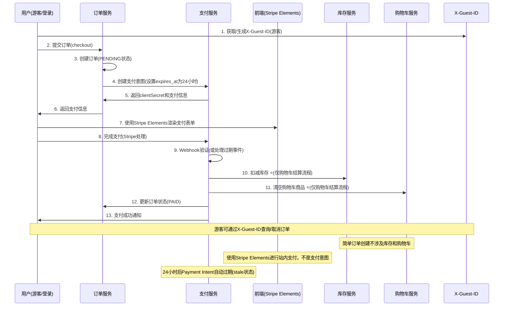

# 订单与支付模块集成修复技术规格文档

**文档版本**: v1.0
**创建日期**: 2024-12-18
**负责人**: Barry - Quick Flow Solo Dev
**优先级**: P0 - 高优先级

---

## 📋 **执行摘要**

本文档详细描述了Moxton Lot API订单模块与支付模块集成缺陷的完整修复方案。核心问题在于当前系统在购物车结算时立即扣减库存，但支付可能失败，导致库存被无效占用。本方案将实现"支付成功才扣减库存"的业务逻辑，并解决状态管理不一致、重复支付风险等集成问题。

**关键改进**:
- ✅ 修复购物车结算的库存扣减时机
- ✅ 扩展取消订单功能支持游客场景
- ✅ 简化状态管理
- ✅ 基于X-Guest-ID的游客订单管理
- ✅ 防重复支付机制
- ✅ 24小时支付意图过期时间
- ✅ Webhook安全加固
- ✅ 完整订单状态流转与权限控制

---

## 🚨 **现状问题分析**

### **核心业务逻辑缺陷**

#### 1. **购物车结算的库存扣减时机错误**
```typescript
// 当前错误逻辑 - src/controllers/Order.ts:checkoutFromCartWithAddress 方法
async checkoutFromCartWithAddress(ctx: Context): Promise<void> {
  // ⚠️ 购物车结算时立即扣减库存 (lines 395-405)
  for (const item of order.items) {
    await this.productModel.updateStock(item.productId, -item.quantity);
  }

  // ⚠️ 立即清空购物车选中商品
  await this.cartService.removeItems(userId, selectedProductIds);

  // ❌ 如果支付失败，库存已被占用，购物车商品已丢失
}

// ✅ 简单订单创建逻辑正确 - src/controllers/Order.ts:createOrder 方法
async createOrder(ctx: Context): Promise<void> {
  // ✅ 不扣减库存，不处理购物车
  // 仅创建订单记录，等待支付处理
}
```

**影响**:
- 购物车结算的支付失败订单占用库存，影响其他用户购买
- 用户支付失败后购物车商品丢失，体验极差
- 库存数据不准确（仅影响购物车结算流程）
- 简单订单创建流程是正确的

#### 2. **状态管理分散**
```typescript
// ❌ 状态更新分散在多个地方
// Order.ts
await prisma.order.update({ where: { id }, data: { status: 'PENDING' } });

// StripePaymentService.ts
await prisma.order.update({ where: { id }, data: { paymentStatus: 'PAYMENT_INITIATED' } });

// Payment.ts
await prisma.order.update({ where: { id }, data: { status: 'PAID' } });
```

**影响**:
- 状态可能出现不一致
- 缺少状态流转验证
- 难以追踪状态变更历史

#### 3. **订单状态流转不完整**
```typescript
// ❌ 缺少完整的订单状态流转管理
// 当前状态：PENDING → PAID → ? (缺少后续状态管理)
// 需要的完整状态：PENDING → PAID → CONFIRMED → SHIPPED → DELIVERED
```

**影响**:
- 订单生命周期不完整
- 缺少发货和收货状态管理
- 无法支持完整的电商业务流程

#### 4. **游客订单管理不完整**
```typescript
// ❌ 游客订单查询基于email/phone，未使用X-Guest-ID
async queryGuestOrder(ctx: Context): Promise<void> {
  const { email, phone, orderNo } = ctx.query;
  // ❌ 未使用已实现的X-Guest-ID架构
}

// ❌ 游客无法取消订单
// PUT /orders/:id/cancel 需要authMiddleware，游客无法访问
```

**影响**:
- 游客订单查询体验不统一
- 游客创建的订单无法通过标准接口取消
- X-Guest-ID架构未充分利用

#### 5. **重复支付风险**
```typescript
// ❌ 缺少并发控制 - src/services/StripePaymentService.ts
async createPaymentIntent(orderId: string) {
  // 没有检查是否已有活跃支付
  const paymentIntent = await stripe.paymentIntents.create({...});
}
```

**影响**:
- 用户可能被重复收费
- 财务对账困难
- 客户投诉风险

---

## 🎯 **解决方案架构**

### **修复后的业务流程**



### **核心组件设计与扩展**

#### 1. **简化状态管理** (增强现有)

**完整状态流转设计**：
```
PENDING → PAID → CONFIRMED → SHIPPED → DELIVERED
                                    ↓
                               CANCELLED
```

**状态变更规则**：
- **PENDING → PAID**：支付成功（Stripe webhook）
- **PAID → CONFIRMED**：支付成功后自动确认
- **CONFIRMED → SHIPPED**：管理员手动发货
- **SHIPPED → DELIVERED**：管理员手动确认收货
- **任何状态 → CANCELLED**：用户/管理员取消（权限控制）
```typescript
// 在现有 StripePaymentService 中添加简单方法
export class StripePaymentService {
  private readonly validTransitions = {
    'PENDING': ['PAID', 'CANCELLED'],
    'PAID': ['CONFIRMED', 'CANCELLED'],
    'CONFIRMED': ['SHIPPED'],
    'SHIPPED': ['DELIVERED'],
    'CANCELLED': []
  };

  private async validateStatusTransition(
    currentStatus: string,
    newStatus: string
  ): boolean {
    return this.validTransitions[currentStatus]?.includes(newStatus) || false;
  }

  private async updateOrderStatus(
    orderId: string,
    newStatus: OrderStatus,
    userId?: string,
    reason?: string
  ): Promise<void> {
    // 简单的状态验证和更新逻辑
    // 使用现有事务确保数据一致性
  }
}
```

#### 2. **扩展取消订单支持游客** (修改现有)
```typescript
// 修改现有路由 - src/routes/orders.ts:23
// 从: router.put('/:id/cancel', authMiddleware, orderController.cancelOrder)
// 改为: router.put('/:id/cancel', optionalAuthMiddleware, orderController.cancelOrder)

// 扩展现有控制器 - src/controllers/Order.ts:cancelOrder方法
async cancelOrder(ctx: Context): Promise<void> {
  const userId = ctx.state.user?.id || null;
  const guestId = ctx.headers['x-guest-id'] as string;
  const { orderId } = ctx.params;

  // ✅ 现有登录用户逻辑保持不变
  if (userId) {
    // 原有逻辑...
  }

  // ✅ 新增游客取消逻辑
  else if (guestId) {
    // 基于X-Guest-ID验证订单归属并取消
  }
}
```

#### 3. **基于X-Guest-ID的游客订单管理** (新增接口)
```typescript
// 新增路由 - src/routes/orders.ts
router.get('/guest/orders', optionalAuthMiddleware, orderController.getGuestOrders);
router.get('/guest/orders/:id', optionalAuthMiddleware, orderController.getGuestOrderById);

// 扩展现有控制器
async getGuestOrders(ctx: Context): Promise<void> {
  const guestId = ctx.headers['x-guest-id'] as string;
  // 基于X-Guest-ID查询游客所有订单
}
```

#### 4. **防重复支付机制** (采用Stripe官方最佳实践)
```typescript
// 修改现有支付服务 - src/services/StripePaymentService.ts
async createPaymentIntent(orderId: string, userId?: string) {
  // ❌ 移除：自定义活跃支付检查（过度设计）
  // const existingPayment = await this.checkActivePayment(orderId);
  // if (existingPayment) {
  //   throw new Error('Payment already in progress');
  // }

  // ✅ 采用Stripe官方方式：使用幂等性键
  const idempotencyKey = `payment_${orderId}_${userId || 'guest'}_${Date.now()}`;

  const paymentIntent = await this.stripe.paymentIntents.create({
    amount: Math.round(order.totalAmount * 100),
    currency: order.currency?.toLowerCase() || 'aud',
    metadata: {
      orderId,
      userId: userId || 'guest',
      orderNumber: order.orderNumber
    },
    // ✅ 简化配置，使用Stripe标准设置
    payment_method_types: ['card'],
    expires_at: Math.floor(Date.now() / 1000) + (24 * 60 * 60), // 24小时标准过期
    confirm: false,
    capture_method: 'automatic'
  }, {
    // ✅ 关键：使用幂等性键防止重复创建
    idempotencyKey: idempotencyKey
  });

  // ✅ 简化数据库记录
  const payment = await prisma.payment.create({
    data: {
      orderId,
      userId: userId || null,
      paymentIntentId: paymentIntent.id,
      amount: order.totalAmount,
      currency: order.currency || 'AUD',
      status: 'PAYMENT_INITIATED',
      method: 'STRIPE',
      expiresAt: new Date(paymentIntent.expires_at * 1000),
      // ✅ 记录幂等性键，便于追踪
      metadata: {
        idempotencyKey: idempotencyKey,
        clientSecret: paymentIntent.client_secret
      }
    }
  });
}
```

#### 5. **修复购物车结算库存逻辑** (修改现有)
```typescript
// 修改现有方法 - src/controllers/Order.ts:checkoutFromCartWithAddress
async checkoutFromCartWithAddress(ctx: Context): Promise<void> {
  // ❌ 移除：立即库存扣减
  // ❌ 移除：立即购物车清空

  // ✅ 仅创建订单和地址记录
  const order = await this.createOrderRecord(orderData);

  // ✅ 创建支付意图(返回clientSecret)
  const paymentData = await this.stripeService.createPaymentIntent(order.id, userId);

  // ✅ 返回订单信息和支付意图数据，等待支付成功处理库存和购物车
  ctx.created({
    orderId: order.id,
    orderNumber: order.orderNumber,
    clientSecret: paymentData.clientSecret,      // 给前端Stripe Elements
    publishableKey: paymentData.publishableKey,  // 前端初始化Stripe
    paymentIntentId: paymentData.paymentIntentId,
    // ... 其他订单信息
  });
}
```

---

## 🔧 **详细技术实现**

### **1. 简化状态管理** (增强现有)

**文件**: `src/services/StripePaymentService.ts` (扩展现有文件)

```typescript
// 在现有 StripePaymentService 类中添加以下方法：

private readonly validTransitions = {
  'PENDING': ['PAID', 'CANCELLED'],
  'PAID': ['CONFIRMED', 'CANCELLED'],
  'CONFIRMED': ['SHIPPED'],
  'SHIPPED': ['DELIVERED'],
  'CANCELLED': [] // 终态
};

/**
 * 简单的状态验证和更新方法
 * 在现有支付成功处理中使用
 */
private async updateOrderStatus(
  orderId: string,
  newStatus: string,
  userId?: string,
  reason?: string
): Promise<void> {
  const order = await prisma.order.findUnique({
    where: { id: orderId }
  });

  if (!order) {
    throw new Error(`Order not found: ${orderId}`);
  }

  // 验证状态流转
  if (!this.validateStatusTransition(order.status, newStatus)) {
    logger.warn('Invalid status transition attempted', {
      orderId,
      fromStatus: order.status,
      toStatus: newStatus
    });
    throw new Error(`Invalid status transition: ${order.status} -> ${newStatus}`);
  }

  // 更新订单状态
  await prisma.order.update({
    where: { id: orderId },
    data: {
      status: newStatus,
      lastStatusUpdateAt: new Date()
    }
  });

  logger.info('Order status updated', {
    orderId,
    orderNumber: order.orderNumber,
    fromStatus: order.status,
    toStatus: newStatus,
    changedBy: userId || 'system',
    reason
  });
}

private validateStatusTransition(current: string, next: string): boolean {
  return this.validTransitions[current]?.includes(next) || false;
}
```

### **2. 修改订单创建逻辑**

**文件**: `src/controllers/Order.ts` (修改checkout方法)

```typescript
// 导入状态管理服务
import orderStatusService from '../services/简化状态管理';

export class OrderController extends BaseController {
  async checkout(ctx: Context): Promise<void> {
    const userId = ctx.state.user?.id || null;
    const { items, guestInfo } = ctx.request.body;

    try {
      // ✅ 1. 创建订单（不处理库存和购物车）
      const order = await prisma.order.create({
        data: {
          userId,
          orderNumber: this.generateOrderNumber(),
          totalAmount: this.calculateTotal(items),
          items: {
            create: items.map(item => ({
              productId: item.productId,
              quantity: item.quantity,
              price: item.price
            }))
          },
          status: 'PENDING',
          paymentStatus: 'AWAITING_PAYMENT',
          guestInfo: guestInfo || null,
          metadata: {
            paymentExpiresAt: new Date(Date.now() + 24 * 60 * 60 * 1000).toISOString(),
            createdAt: new Date().toISOString()
          }
        },
        include: { items: true }
      });

      // ✅ 2. 记录状态变更（使用统一服务）
      await orderStatusService.updateOrderStatus(
        order.id,
        'PENDING',
        userId,
        'Order created, awaiting payment'
      );

      // ✅ 3. 创建支付意图（24小时有效，返回clientSecret）
      const paymentData = await this.stripeService.createPaymentIntent(
        order.id,
        userId
      );

      // ✅ 4. 返回订单信息（不清空购物车，不扣减库存）
      ctx.created({
        orderId: order.id,
        orderNumber: order.orderNumber,
        totalAmount: order.totalAmount,
        items: order.items,
        clientSecret: paymentData.clientSecret,        // 前端Stripe Elements使用
        publishableKey: paymentData.publishableKey,  // 前端初始化Stripe
        paymentIntentId: paymentData.paymentIntentId,
        expiresAt: order.metadata.paymentExpiresAt,
        message: 'Order created successfully. Please complete payment within 24 hours.'
      });

    } catch (error) {
      logger.error('Order checkout failed', {
        error: error.message,
        userId,
        items: items.length
      });
      ctx.badRequest(error.message);
    }
  }

  // ✅ 新增：用户取消订单功能
  async cancelOrder(ctx: Context): Promise<void> {
    const { orderId } = ctx.params;
    const userId = ctx.state.user?.id || null;
    const { reason } = ctx.request.body;

    try {
      const order = await prisma.order.findUnique({
        where: { id: orderId }
      });

      if (!order) {
        return ctx.notFound('Order not found');
      }

      // 权限检查：只能取消自己的订单
      if (order.userId !== userId) {
        return ctx.forbidden('Access denied: not your order');
      }

      // 状态检查：只能取消未支付的订单
      if (!['PENDING'].includes(order.status)) {
        return ctx.badRequest('Order cannot be cancelled');
      }

      // ✅ 使用简化状态管理
      await orderStatusService.updateOrderStatus(
        orderId,
        'CANCELLED',
        userId,
        reason || 'User cancelled order'
      );

      // 更新相关支付记录状态
      if (order.paymentId) {
        await prisma.payment.update({
          where: { id: order.paymentId },
          data: { status: 'CANCELLED' }
        });
      }

      ctx.ok({
        message: 'Order cancelled successfully',
        orderId: order.id,
        orderNumber: order.orderNumber,
        cancelledAt: new Date()
      });

    } catch (error) {
      logger.error('Order cancellation failed', {
        error: error.message,
        orderId,
        userId
      });
      ctx.badRequest(error.message);
    }
  }
}
```

### **3. 修改支付成功处理**

**文件**: `src/services/StripePaymentService.ts`

```typescript
import orderStatusService from './简化状态管理';

export class StripePaymentService {
  async handlePaymentSuccess(paymentIntent: any): Promise<void> {
    const orderId = paymentIntent.metadata.orderId;

    try {
      await prisma.$transaction(async (tx) => {
        // 1. 获取订单信息
        const order = await tx.order.findUnique({
          where: { id: orderId },
          include: { items: true }
        });

        if (!order) {
          throw new Error(`Order not found: ${orderId}`);
        }

        // 2. ✅ 扣减库存（支付成功后才执行）
        for (const item of order.items) {
          const result = await tx.product.update({
            where: {
              id: item.productId,
              stock: { gte: item.quantity } // 确保库存充足
            },
            data: {
              stock: { decrement: item.quantity },
              soldCount: { increment: item.quantity },
              lastStockUpdateAt: new Date()
            }
          });

          if (!result) {
            throw new Error(
              `Insufficient stock for product ${item.productId}. Required: ${item.quantity}`
            );
          }

          logger.info('Stock deducted', {
            productId: item.productId,
            quantity: item.quantity,
            orderId,
            remainingStock: result.stock
          });
        }

        // 3. ✅ 更新订单状态（使用统一服务）
        await orderStatusService.updateOrderStatus(
          orderId,
          'PAID',
          order.userId || undefined,
          'Payment completed successfully'
        );

        // 4. ✅ 更新支付记录
        await tx.payment.update({
          where: { paymentIntentId: paymentIntent.id },
          data: {
            status: 'COMPLETED',
            paidAt: new Date(),
            metadata: {
              stripePaymentIntentId: paymentIntent.id,
              completedAt: new Date().toISOString(),
              paymentMethod: 'STRIPE'
            }
          }
        });

        // 5. ✅ 清空购物车对应商品（仅限登录用户）
        if (order.userId) {
          const productIds = order.items.map(item => item.productId);

          const deletedItems = await tx.cartItem.deleteMany({
            where: {
              userId: order.userId,
              productId: { in: productIds }
            }
          });

          logger.info('Cart items cleared after payment', {
            userId: order.userId,
            orderId,
            deletedCount: deletedItems.count,
            productIds
          });
        }

        logger.info('Payment success processing completed', {
          orderId,
          orderNumber: order.orderNumber,
          paymentIntentId: paymentIntent.id,
          amount: paymentIntent.amount / 100,
          currency: paymentIntent.currency
        });
      });

    } catch (error) {
      logger.error('Payment success processing failed', {
        orderId,
        paymentIntentId: paymentIntent.id,
        error: error.message,
        stack: error.stack
      });

      // 标记支付为失败状态
      await prisma.payment.update({
        where: { paymentIntentId: paymentIntent.id },
        data: {
          status: 'FAILED',
          metadata: {
            error: error.message,
            failedAt: new Date().toISOString()
          }
        }
      });

      throw error;
    }
  }

  // ✅ 修改：添加防重复支付检查
  async createPaymentIntent(orderId: string, userId?: string): Promise<any> {
    try {
      // 1. 检查是否有活跃支付
      const existingPayment = await prisma.payment.findFirst({
        where: {
          orderId,
          status: { in: ['PENDING', 'PAYMENT_INITIATED', 'PROCESSING'] }
        }
      });

      if (existingPayment) {
        throw new Error('Payment already in progress for this order');
      }

      // 2. 获取订单信息
      const order = await prisma.order.findUnique({
        where: { id: orderId },
        include: { items: true }
      });

      if (!order) {
        throw new Error('Order not found');
      }

      // 3. 检查订单状态
      if (order.status !== 'PENDING') {
        throw new Error(`Order cannot be paid. Current status: ${order.status}`);
      }

      // 4. 验证支付时效（24小时内）
      const expiresAt = new Date(order.metadata.paymentExpiresAt);
      if (new Date() > expiresAt) {
        throw new Error('Payment link has expired');
      }

      // 5. 重新计算订单金额（防篡改）
      const calculatedAmount = order.items.reduce((sum, item) =>
        sum + (item.price * item.quantity), 0
      );

      if (Math.abs(calculatedAmount - order.totalAmount) > 0.01) {
        throw new Error('Order amount mismatch - possible tampering detected');
      }

      // 6. 创建Stripe支付意图（24小时过期）
      const paymentIntent = await this.stripe.paymentIntents.create({
        amount: Math.round(order.totalAmount * 100),
        currency: order.currency?.toLowerCase() || 'aud',
        metadata: {
          orderId,
          userId: userId || 'guest',
          orderNumber: order.orderNumber,
          createdAt: new Date().toISOString()
        },
        payment_method_types: ['card'],
        // ✅ 设置24小时过期时间
        expires_at: Math.floor(Date.now() / 1000) + (24 * 60 * 60),
        confirm: false,
        capture_method: 'automatic'
      });

      // 7. 创建支付记录
      const payment = await prisma.payment.create({
        data: {
          orderId,
          userId: userId || null,
          paymentIntentId: paymentIntent.id,
          amount: order.totalAmount,
          currency: order.currency || 'AUD',
          status: 'PAYMENT_INITIATED',
          method: 'STRIPE',
          metadata: {
            stripePaymentIntentId: paymentIntent.id,
            clientSecret: paymentIntent.client_secret,
            expiresAt: new Date(paymentIntent.expires_at * 1000).toISOString()
          }
        }
      });

      // 8. 更新订单支付状态
      await orderStatusService.updateOrderStatus(
        orderId,
        'PENDING', // 状态不变，但记录支付初始化
        userId,
        'Payment intent created'
      );

      logger.info('Payment intent created', {
        orderId,
        orderNumber: order.orderNumber,
        paymentIntentId: paymentIntent.id,
        amount: order.totalAmount,
        currency: order.currency,
        expiresAt: new Date(paymentIntent.expires_at * 1000)
      });

      return {
        clientSecret: paymentIntent.client_secret,
        paymentId: payment.id,
        paymentIntentId: paymentIntent.id,
        expiresAt: new Date(paymentIntent.expires_at * 1000)
      };

    } catch (error) {
      logger.error('Payment intent creation failed', {
        orderId,
        userId,
        error: error.message
      });
      throw error;
    }
  }
}
```

### **4. 加强Webhook安全与事件去重**

**文件**: `src/controllers/Payment.ts`

```typescript
import Redis from 'ioredis';
import crypto from 'crypto';

const redis = new Redis(process.env.REDIS_URL);

export class PaymentController extends BaseController {
  async handleStripeWebhook(ctx: Context): Promise<void> {
    const rawBody = ctx.request.body;
    const signature = ctx.headers['stripe-signature'] as string;
    const webhookSecret = process.env.STRIPE_WEBHOOK_SECRET;

    try {
      // ✅ 1. 验证webhook签名
      const event = this.stripe.webhooks.constructEvent(
        rawBody,
        signature,
        webhookSecret
      );

      // ✅ 2. 检查事件时效性（防重放攻击）
      const eventAge = Date.now() - (event.created * 1000);
      if (eventAge > 300000) { // 5分钟
        throw new Error('Webhook event too old - possible replay attack');
      }

      // ✅ 3. 关键：事件去重检查（Stripe官方强烈建议）
      const isProcessed = await this.checkEventProcessed(event.id);
      if (isProcessed) {
        logger.warn('Webhook event already processed', {
          eventId: event.id,
          eventType: event.type
        });
        ctx.ok({ received: true, status: 'duplicate' });
        return;
      }

      // ✅ 4. 标记事件为已处理（幂等性保证）
      await this.markEventProcessed(event.id);

      // ✅ 5. 处理事件（幂等处理）
      await this.processWebhookEvent(event);

      logger.info('Webhook processed successfully', {
        eventId: event.id,
        eventType: event.type,
        processedAt: new Date()
      });

      ctx.ok({
        received: true,
        eventId: event.id,
        eventType: event.type,
        processedAt: new Date()
      });

    } catch (error) {
      logger.error('Webhook processing failed', {
        error: error.message,
        signature: signature?.substring(0, 20) + '...',
        webhookId: ctx.headers['stripe-request-id']
      });

      ctx.status(400);
      ctx.body = {
        error: 'Webhook processing failed',
        message: error.message
      };
    }
  }

  /**
   * ✅ 新增：检查事件是否已处理（幂等性检查）
   */
  private async checkEventProcessed(eventId: string): Promise<boolean> {
    try {
      // 优先从Redis检查（性能更好）
      const redisKey = `stripe_event:${eventId}`;
      const exists = await redis.exists(redisKey);

      if (exists) {
        return true;
      }

      // Redis中没有则检查数据库
      const processedEvent = await prisma.processedWebhookEvent.findUnique({
        where: { eventId }
      });

      return !!processedEvent;
    } catch (error) {
      logger.error('Error checking event processing status', {
        eventId,
        error: error.message
      });
      return false;
    }
  }

  /**
   * ✅ 新增：标记事件为已处理
   */
  private async markEventProcessed(eventId: string): Promise<void> {
    try {
      // Redis中标记（24小时过期）
      const redisKey = `stripe_event:${eventId}`;
      await redis.setex(redisKey, 86400, 'processed');

      // 数据库中永久记录
      await prisma.processedWebhookEvent.create({
        data: {
          eventId,
          processedAt: new Date()
        }
      });
    } catch (error) {
      logger.error('Error marking event as processed', {
        eventId,
        error: error.message
      });
      // 不抛出错误，避免重试处理
    }
  }

  private async processWebhookEvent(event: any): Promise<void> {
    switch (event.type) {
      case 'payment_intent.succeeded':
        await this.stripePaymentService.handlePaymentSuccess(event.data.object);
        break;

      case 'payment_intent.payment_failed':
        await this.handlePaymentFailure(event.data.object);
        break;

      case 'payment_intent.canceled':
        await this.handlePaymentCancellation(event.data.object);
        break;

      // ✅ 新增：处理支付意图过期事件
      case 'payment_intent.payment_expired':
        await this.handlePaymentExpiration(event.data.object);
        break;

      default:
        logger.info('Unhandled webhook event type', {
          eventType: event.type,
          eventId: event.id
        });
    }
  }

  // ✅ 新增：支付意图过期处理方法
  private async handlePaymentExpiration(paymentIntent: any): Promise<void> {
    const orderId = paymentIntent.metadata.orderId;

    try {
      // 更新支付记录状态为过期
      await prisma.payment.update({
        where: { paymentIntentId: paymentIntent.id },
        data: {
          status: 'EXPIRED',
          metadata: {
            expiredAt: new Date().toISOString(),
            reason: 'Payment intent expired automatically'
          }
        }
      });

      // 可选：将订单状态标记为过期或取消
      await prisma.order.update({
        where: { id: orderId },
        data: {
          status: 'CANCELLED',
          lastStatusUpdateAt: new Date(),
          metadata: {
            reason: 'Payment expired - 24 hour limit reached',
            expiredAt: new Date().toISOString()
          }
        }
      });

      logger.info('Payment expiration processed', {
        orderId,
        paymentIntentId: paymentIntent.id,
        expiredAt: new Date()
      });

    } catch (error) {
      logger.error('Payment expiration processing failed', {
        orderId,
        paymentIntentId: paymentIntent.id,
        error: error.message
      });
    }
  }

  private async handlePaymentFailure(paymentIntent: any): Promise<void> {
    const orderId = paymentIntent.metadata.orderId;

    try {
      await prisma.payment.update({
        where: { paymentIntentId: paymentIntent.id },
        data: {
          status: 'FAILED',
          metadata: {
            failureReason: paymentIntent.last_payment_error?.message || 'Unknown',
            failedAt: new Date().toISOString()
          }
        }
      });

      logger.info('Payment failure processed', {
        orderId,
        paymentIntentId: paymentIntent.id,
        reason: paymentIntent.last_payment_error?.message
      });

    } catch (error) {
      logger.error('Payment failure processing failed', {
        orderId,
        paymentIntentId: paymentIntent.id,
        error: error.message
      });
    }
  }
}
```

### **5. 数据库Schema优化**

**文件**: `prisma/schema.prisma`

```prisma
// ✅ 简化Payment表设计（移除冗余字段）
model Payment {
  id              String   @id @default(cuid())
  orderId         String
  userId          String?
  paymentIntentId String   @unique // ✅ 唯一支付意图ID
  amount          Float
  currency        String   @default("AUD")
  status          String
  method          String
  expiresAt       DateTime?
  paidAt          DateTime?
  createdAt       DateTime @default(now())
  updatedAt       DateTime @updatedAt
  metadata        Json?

  // ✅ 移除冗余字段，简化约束
  @@index([orderId])
  @@index([status])
  @@index([paymentIntentId])
}

// ✅ 新增：Webhook事件去重表
model ProcessedWebhookEvent {
  id         String   @id @default(cuid())
  eventId    String   @unique // Stripe事件ID
  processedAt DateTime @default(now())

  @@index([eventId])
  @@index([processedAt])
}

// ✅ Order表字段优化
model Order {
  // ... 现有字段保持不变

  // ✅ 必要的新增字段
  lastStatusUpdateAt DateTime?
  metadata          Json?   // 用于存储状态历史等信息

  // ✅ 优化索引设计
  @@index([status])
  @@index([userId])
  @@index([createdAt])
  @@index([orderNo])
}

// ✅ Product表字段优化
model Product {
  // ... 现有字段保持不变

  // ✅ 必要的新增字段
  lastStockUpdateAt DateTime?
  soldCount         Int      @default(0)
  metadata          Json?   // 用于存储销售统计等信息

  @@index([status])
  @@index([createdAt])
}
```

### **6. 路由配置**

**文件**: `src/routes/orders.ts`

```typescript
import Router from '@koa/router';
import { authMiddleware } from '../middleware';
import OrderController from '../controllers/Order';

const router = new Router();

// ✅ 新增取消订单路由
router.post('/cancel/:orderId', authMiddleware, OrderController.cancelOrder);

// 现有路由保持不变
router.post('/checkout', authMiddleware, OrderController.checkout);
router.get('/', authMiddleware, OrderController.getOrders);
router.get('/:orderId', authMiddleware, OrderController.getOrderById);

export default router;
```

---

## 📋 **修正后实施步骤（符合Stripe最佳实践）**

### **阶段1：Stripe官方最佳实践对齐 (第1-2小时)**

1. **简化防重复支付机制** (修改现有)
   - 移除自定义活跃支付检查（过度设计）
   - 采用Stripe幂等性键（idempotencyKey）
   - 简化Payment Intent创建逻辑

2. **Webhook事件去重机制** (新增)
   - 实现checkEventProcessed方法
   - 实现markEventProcessed方法
   - 创建ProcessedWebhookEvent数据表

### **阶段2：核心业务问题修复 (第3-4小时)**

3. **增强现有状态管理** (修改现有)
   - 在StripePaymentService中添加状态验证
   - 实现完整的订单状态流转
   - 改进日志记录和追踪

4. **支付意图过期设置优化**
   - 修改createPaymentIntent添加24小时expires_at参数
   - 统一数据库过期时间字段
   - 添加payment_intent.payment_expired事件处理

### **阶段3：用户体验优化 (第5-6小时)**

5. **扩展取消订单支持游客** (修改现有)
   - 修改路由为optionalAuthMiddleware
   - 扩展cancelOrder控制器方法
   - 添加X-Guest-ID验证逻辑

6. **新增基于X-Guest-ID的游客订单管理** (新增)
   - 实现getGuestOrders接口
   - 实现getGuestOrderById接口
   - 完善游客订单查询体验

### **阶段4：购物车结算逻辑修复 (第7-8小时)**

7. **修复购物车结算库存逻辑** (修改现有)
   - 修改checkoutFromCartWithAddress方法
   - 移除立即库存扣减和购物车清空
   - 确保支付成功后才处理库存和购物车

8. **数据库Schema优化**
   - 简化Payment表设计，移除冗余字段
   - 优化索引设计
   - 添加必要的metadata字段

### **阶段5：管理后台功能 (第9-10小时)**

9. **管理员订单状态管理** (新增)
   - 实现PUT /admin/orders/:id/ship接口
   - 实现PUT /admin/orders/:id/deliver接口
   - 添加物流信息管理功能

10. **权限控制完善**
    - 明确用户和管理员权限分离
    - 实现adminMiddleware
    - 添加数据访问权限控制

### **阶段6：清理和文档 (第11小时)**

11. **优化和清理**
    - 创建过期订单清理脚本
    - 优化日志记录
    - 添加监控指标

12. **文档和测试**
    - 更新API文档
    - 编写单元测试
    - 集成测试验证

---

## 🧪 **测试方案**

### **1. 单元测试（符合Stripe最佳实践）**

```typescript
// tests/services/StripePaymentService.test.ts
describe('StripePaymentService - Idempotency', () => {
  test('should use idempotency key correctly', async () => {
    const service = new StripePaymentService();
    const idempotencyKey = `payment_${orderId}_${Date.now()}`;

    // 第一次创建应该成功
    const payment1 = await service.createPaymentIntent(orderId, userId, { idempotencyKey });

    // 第二次使用相同幂等性键应该返回相同结果
    const payment2 = await service.createPaymentIntent(orderId, userId, { idempotencyKey });

    expect(payment1.paymentIntentId).toBe(payment2.paymentIntentId);
  });

  test('should handle status transitions', async () => {
    const service = new StripePaymentService();
    const result = await service.validateStatusTransition('PENDING', 'PAID');
    expect(result).toBe(true);

    const invalidResult = await service.validateStatusTransition('PENDING', 'DELIVERED');
    expect(invalidResult).toBe(false);
  });
});

// tests/controllers/PaymentController.test.ts
describe('Webhook Event Processing', () => {
  test('should prevent duplicate webhook event processing', async () => {
    const controller = new PaymentController();

    // 第一次处理事件
    await controller.processWebhookEvent(mockEvent);

    // 第二次处理相同事件应该被跳过
    await controller.processWebhookEvent(mockEvent);

    // 验证只处理了一次
    expect(logSpy).toHaveBeenCalledWith('Webhook event already processed', expect.any(Object));
  });
});
```

### **2. 集成测试**

```typescript
// tests/integration/order-payment-flow.test.ts
describe('Order Payment Flow', () => {
  test('complete payment flow with idempotency', async () => {
    // 1. 创建订单（使用幂等性键）
    const orderResponse = await request(app)
      .post('/orders/checkout')
      .send({ items: testItems })
      .expect(201);

    // 2. 验证库存未扣减
    const product = await prisma.product.findUnique({
      where: { id: testItems[0].productId }
    });
    expect(product.stock).toBe(initialStock);

    // 3. 模拟支付成功（带事件去重）
    await paymentController.processWebhookEvent(mockPaymentSuccessEvent);

    // 4. 验证库存已扣减
    const updatedProduct = await prisma.product.findUnique({
      where: { id: testItems[0].productId }
    });
    expect(updatedProduct.stock).toBe(initialStock - testItems[0].quantity);

    // 5. 验证事件已标记为已处理
    const processedEvent = await prisma.processedWebhookEvent.findUnique({
      where: { eventId: mockPaymentSuccessEvent.id }
    });
    expect(processedEvent).toBeTruthy();
  });
});
```

### **3. 性能测试**

```typescript
// tests/performance/concurrent-payments.test.ts
describe('Concurrent Payments with Idempotency', () => {
  test('handle concurrent payment requests with same idempotency key', async () => {
    const idempotencyKey = `test_${Date.now()}`;
    const promises = Array.from({ length: 10 }, () =>
      paymentService.createPaymentIntent(orderId, userId, { idempotencyKey })
    );

    const results = await Promise.allSettled(promises);
    const successful = results.filter(r => r.status === 'fulfilled');

    // 所有请求都应该成功并返回相同结果（幂等性保证）
    expect(successful).toHaveLength(10);
    const paymentIds = successful.map(r => r.value.paymentIntentId);
    const uniqueIds = [...new Set(paymentIds)];
    expect(uniqueIds).toHaveLength(1);
  });
});
```

---

## 🔍 **风险评估与缓解策略**

### **技术风险**

#### 1. **数据库事务死锁**
**风险**: 库存扣减和状态更新可能导致死锁
**概率**: 中等
**影响**: 支付处理失败
**缓解策略**:
- 固定表访问顺序
- 添加重试机制
- 设置合理的超时时间

#### 2. **Webhook处理失败**
**风险**: Stripe webhook处理失败导致状态不一致
**概率**: 低
**影响**: 订单状态不更新
**缓解策略**:
- 幂等性处理
- 重试机制
- 状态同步检查

#### 3. **并发支付竞争**
**风险**: 多个并发支付请求可能导致重复扣款
**概率**: 中等
**影响**: 财务损失
**缓解策略**:
- 数据库唯一约束
- Redis分布式锁
- 原子性操作

### **业务风险**

#### 1. **库存超卖**
**风险**: B2B场景下超卖影响较小但仍需考虑
**概率**: 低
**影响**: 客户满意度下降
**缓解策略**:
- 库存实时检查
- 预留机制（未来可选）
- 超卖预警

#### 2. **支付意图过期**
**风险**: 用户24小时内未完成支付
**概率**: 中等
**影响**: 订单积压
**缓解策略**:
- 邮件提醒
- 订单自动取消
- 状态定期清理

---

## 📊 **监控指标**

### **业务指标**
- 支付成功率
- 订单取消率
- 库存准确率
- 平均处理时间

### **技术指标**
- API响应时间
- 数据库连接数
- 错误率
- 并发处理能力

### **安全指标**
- Webhook处理失败次数
- 重复支付尝试次数
- 状态流转异常次数

---

## 📚 **相关文档**

- [Moxton Lot API项目文档](./CLAUDE.md)
- [Prisma ORM文档](https://www.prisma.io/docs)
- [Stripe支付集成指南](https://stripe.com/docs/payments)
- [Koa.js框架文档](https://koajs.com/)

---

## 🔄 **版本更新日志**

### v1.0 (2024-12-18)
- ✅ 初始版本
- ✅ 完整的技术规格文档
- ✅ 详细的实施计划
- ✅ 风险评估和缓解策略

---

**文档维护**: 随着实施进展，本文档将持续更新。如有问题或建议，请联系项目团队。

**下一步**: 等待技术规格评审通过后，开始实施阶段1的代码开发工作。